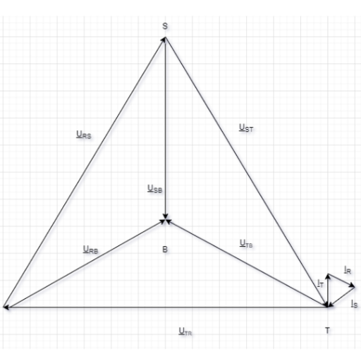
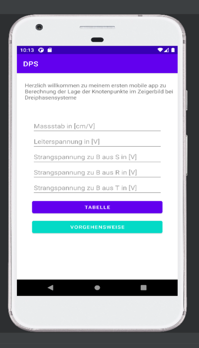
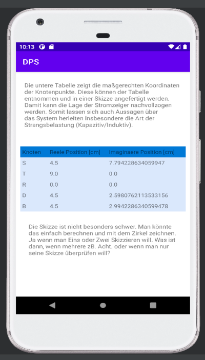

# Dreiphasensysteme - Android und HTML (JAVASCRIPT + CSS)
Zeigerbilder und Ortskurve
Android App für die Bestimmung der Lage von Knotenpunkten S,R,T,D, und B bei gemessenen/berechneten Strangspannungen. 

 
